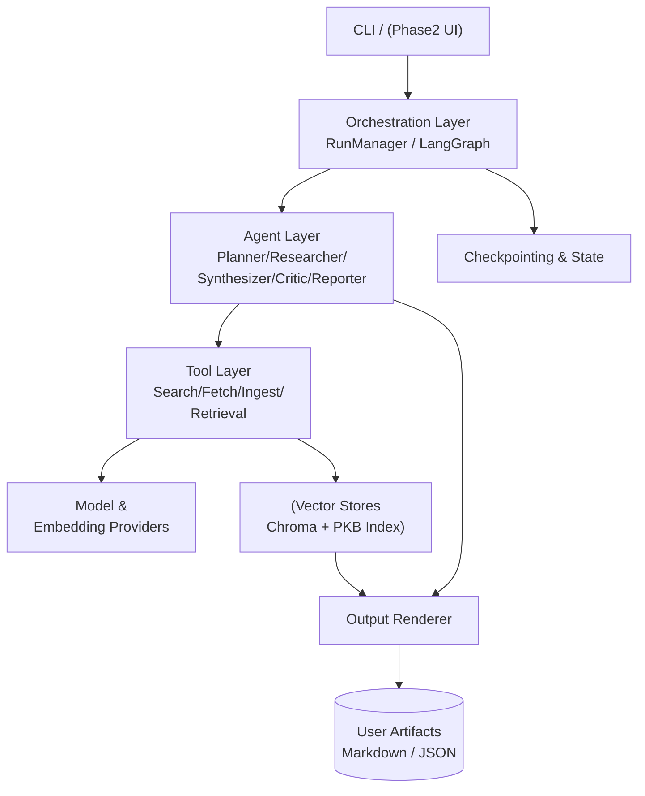
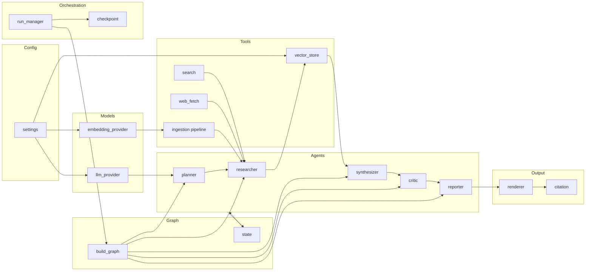
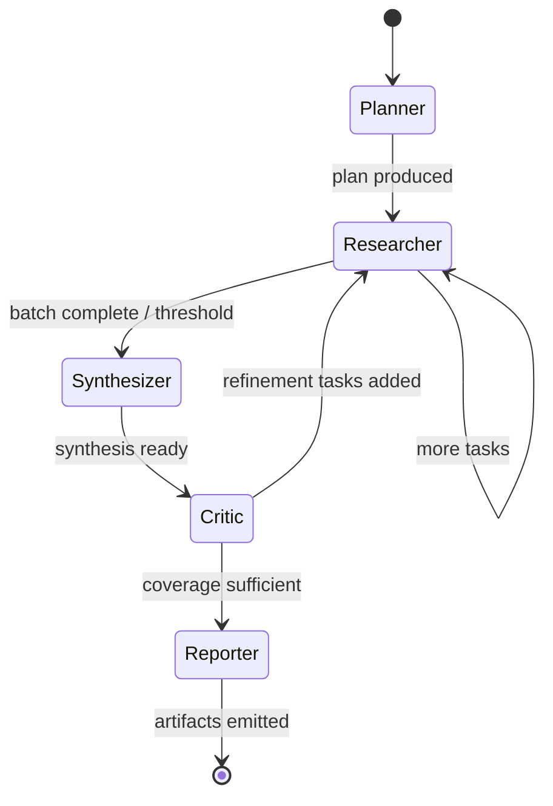
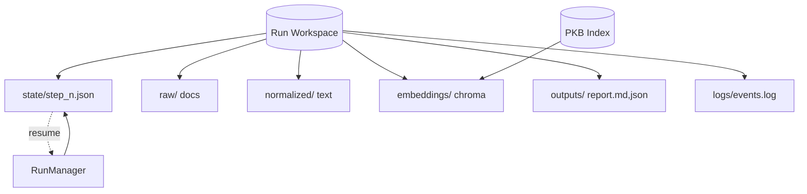
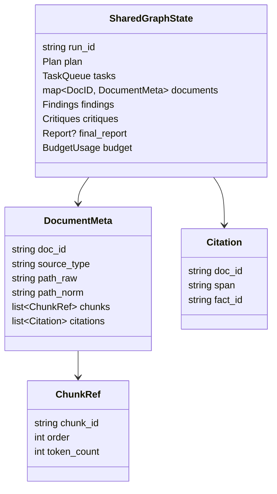

# DeepR Architecture (Draft)

Status: Pending approval

## 1. Architectural Overview
DeepR is a modular, layered system orchestrating multi-agent deep research workflows locally. It combines:
- Orchestration Layer: LangGraph / Deep Agents style graph controlling agent role transitions.
- Agent Layer: Specialized role classes (Planner, Researcher, Synthesizer, Critic, Reporter) operating over shared state.
- Tool Layer: Uniform adapters (search, fetch, parse, embed, retrieve) registered in a ToolRegistry.
- Data & Persistence Layer: Chroma vector stores (per-run + PKB), file-based raw cache, checkpoint state store.
- Model Layer: Abstractions for Completion (LLM) and Embeddings across Ollama, LM Studio, optional remote APIs.
- Interface Layer: CLI (Phase 1), optional UI adapter (Phase 2).

Key principle: Each layer depends only on lower layers; dependency inversion via interfaces for tools and models.

## 2. Module / Package Layout
```
src/deepr/
  __init__.py
  config/
    __init__.py
    settings.py            # Pydantic Settings & validation
    defaults.py            # Default values & model maps
  models/
    llm_provider.py        # ModelProvider + concrete (OllamaProvider, LMStudioProvider, RemoteProvider)
    embedding_provider.py  # EmbeddingProvider abstraction
    prompt_templates.py    # Centralized prompt fragments & system messages
  tools/
    __init__.py
    base.py                # BaseTool interface (sync/async execute, schema)
    search.py              # Tavily, DuckDuckGo
    web_fetch.py           # HTTP fetch + readability cleaning
    pdf_loader.py          # PDF ingestion
    file_loader.py         # Local file ingest (PKB)
    github_fetch.py        # Optional code fetch
    arxiv.py               # Optional scholarly fetch
  ingestion/
    pipeline.py            # Orchestrates loaders → chunkers → embedding
    chunking.py            # Strategies (token, semantic future)
    normalizer.py          # Clean & unify text
  retrieval/
    vector_store.py        # Chroma wrapper (project + pkb indexes)
    doc_store.py           # Metadata & raw text persistence
  pkb/
    watcher.py             # (Phase 2) optional FS watcher
    indexer.py             # Batch ingest of configured PKB dirs
  agents/
    base.py                # BaseAgent (role id, run method, tool access)
    planner.py
    researcher.py
    synthesizer.py
    critic.py
    reporter.py
    policies.py            # Guardrails / cost policies
  graph/
    build_graph.py         # LangGraph assembly factory
    state.py               # SharedGraphState dataclass (plan, findings, docs, budget, checkpoints)
    transitions.py         # Transition predicates
  orchestration/
    run_manager.py         # High-level orchestrator launching runs
    checkpoint.py          # Serialization & resume logic
    events.py              # Event models for logging/streaming
  output/
    renderer.py            # Markdown + JSON generation
    citation.py            # Citation map builder
  cli/
    main.py                # Typer entrypoint
  logging/
    logger.py              # Structured logging config
  utils/
    ids.py, time.py, io.py
  testsupport/
    fixtures.py            # Common pytest fixtures

scripts/
  bootstrap_models.py      # Download embeddings & sample models
  demo_run.sh              # Example invocation

checkpoints.md             # Rolling progress log (root)
requirements.md            # Approved requirements
architecture.md            # This document
```

## 3. Configuration Schema (Pydantic Outline)
```python
class ModelConfig(BaseModel):
    provider: Literal['ollama','lmstudio','remote']
    model: str
    temperature: float = 0.2
    max_tokens: int | None = None
    role_overrides: dict[str, str] = {}  # e.g. {'synthesizer': 'gpt-oss:120b'}

class EmbeddingConfig(BaseModel):
    provider: Literal['sentence_transformers','huggingface_local']
    model: str
    dim: int | None = None

class SearchConfig(BaseModel):
    enable_tavily: bool = True
    enable_duckduckgo: bool = True
    max_results: int = 10

class PKBConfig(BaseModel):
    paths: list[Path] = []
    auto_index: bool = False

class ConcurrencyConfig(BaseModel):
    max_fetch_parallel: PositiveInt = 4
    embed_batch_size: int = 16

class BudgetConfig(BaseModel):
    max_tokens: int | None = None
    max_time_seconds: int | None = None

class DeepRSettings(BaseModel):
    model: ModelConfig
    embedding: EmbeddingConfig
    search: SearchConfig
    pkb: PKBConfig
    concurrency: ConcurrencyConfig
    budget: BudgetConfig
    workspace_root: Path
    output_formats: list[str] = ['markdown','json']
    cache_dir: Path
```

## 4. Core Abstractions
- BaseTool: name, description, input_schema (Pydantic), async execute(context, input) -> ToolResult
- Agent: receives SharedGraphState, selects tools / model prompts, produces partial state update + events.
- SharedGraphState: plan, tasks_queue, collected_docs, embeddings_index_refs, findings, critiques, final_report, budget_usage.
- ModelProvider: generate(prompt, stream=False) and supports role-specific overrides.
- EmbeddingProvider: embed_texts(list[str]) -> list[vector]
- VectorStore: add(docs), similarity_search(query, k, filter)

## 5. Data Flow (Typical Run)
1. CLI parses query -> create run workspace directory (slug).
2. Settings loaded & validated.
3. Graph built with nodes = agents + terminal.
4. Planner creates hierarchical plan -> tasks_queue.
5. Loop: Researcher pops next task -> selects tool(s) (search → fetch → ingest pipeline) -> documents embedded & stored.
6. Synthesizer periodically aggregates findings -> intermediate synthesis.
7. Critic evaluates coverage & hallucination risk -> may push refinement tasks.
8. When plan tasks complete & critique satisfied, Reporter generates final artifacts (Markdown + JSON citation map).
9. Checkpoint after each major phase; on crash resume from latest serialized SharedGraphState.

## 6. Sequence (Text Diagram) - Document Acquisition
```
User -> CLI -> RunManager: start(query)
RunManager -> Graph: execute()
Graph(Planner) -> ModelProvider: generate(plan_prompt)
Graph -> State: store plan
Graph(Researcher) -> SearchTool: search(query_segment)
SearchTool -> External API(s): HTTP
SearchTool -> Researcher: results
Researcher -> FetchTool: fetch(url)
FetchTool -> Cleaner: normalize(html)
Cleaner -> IngestionPipeline: chunk & embed
IngestionPipeline -> EmbeddingProvider -> VectorStore
VectorStore -> State: doc ref ids
```

## 7. Checkpointing Strategy
- After each agent node completes, serialize SharedGraphState (JSON + pickle for any complex objects) under `runs/<slug>/state/step_<n>.json`.
- Keep rolling window (last N = 5) plus milestone tags (post-plan, mid-run, pre-report).
- Resume logic: load latest checkpoint & reconstruct vector store handles (IDs preserved in metadata).

## 8. Persistence Layout Per Run
```
runs/<slug>/
  input_query.txt
  plan.json
  state/step_*.json
  raw/
    <doc_id>.html|pdf|txt
  normalized/
    <doc_id>.txt
  embeddings/
    chroma/  # Chroma collection files
  outputs/
    report.md
    report.json
    citations.json
  logs/
    events.log  (structured JSON lines)
```
PKB index separate:
```
workspace/pkb/chroma/
```

## 9. Concurrency & Resource Control
- Async tasks orchestrated with asyncio.gather limited by semaphore (max 4 fetches)
- Embedding batching to reduce overhead.
- Token budgeting: lightweight tracker increments approximate tokens used based on prompt + completion lengths; critic can halt if over budget.

## 10. Error Handling & Resilience
- Tool errors wrapped in ToolError with category (network, parse, rate_limit)
- Retry (tenacity) for transient categories.
- If search fails entirely, fallback to previous cached results if any.
- Partial failures logged; system continues unless plan critical tasks all fail.

## 11. Logging & Observability
- Structured events: {timestamp, run_id, agent, event_type, payload}
- Rich console: progress bars for tasks_queue size, docs ingested, tokens.
- Optional streaming callbacks for future UI.

## 12. Security / Privacy
- No external calls unless corresponding tool enabled.
- Redact API keys in logs.
- Local storage only; user responsible for data retention.

## 13. Extensibility Points
- Add new Tool: subclass BaseTool and register via entry in tools/__init__.py or dynamic discovery.
- New Agent Role: implement run(state) returning state delta + events, add node in graph builder.
- Alternative Vector Store: implement same interface and swap in settings.
- UI Integration (Phase 2): subscribe to event stream for real-time rendering.

## 14. Testing Strategy Mapping
| Component | Test Type | Example |
|-----------|-----------|---------|
| Config Loader | Unit | Invalid path, default overrides |
| ModelProvider | Unit (mock HTTP) | Stream vs non-stream correctness |
| SearchTool | Unit + VCR | Query mapping, empty result handling |
| Ingestion Pipeline | Unit | Chunk size logic, dedup |
| VectorStore Wrapper | Unit | Similarity ordering, filter logic |
| Planner Agent | Unit (mock LLM) | Produces structured plan schema |
| Researcher Agent | Integration | End-to-end search->fetch->embed path |
| Synthesizer Agent | Unit | Aggregation merges citations |
| Critic Agent | Unit | Flags missing citations |
| Reporter | Unit | Output includes mandatory sections |
| Checkpointing | Integration | Resume mid-run persists plan |
| Full Run | Integration | Small query yields report & citations |
| Regression | Snapshot | Compare report.md vs stored baseline |

## 15. Initial Prompts (Conceptual Skeleton)
- Planner System Prompt: Role, format (JSON phases -> tasks), constraints.
- Researcher: Given task + prior findings, decide tool usage, produce extraction bullet points.
- Synthesizer: Merge new findings into structured sections.
- Critic: Evaluate coverage, hallucination risk (missing citations), propose follow-up tasks (JSON).
- Reporter: Generate final structured markdown + citations map referencing doc_ids.
(Prompts stored in `prompt_templates.py` for maintainability.)

## 16. Implementation Phases (High-Level)
1. Scaffolding (config, CLI stub, logging, base abstractions)
2. Model + Embedding providers
3. Tools (search, fetch, ingest pipeline minimal)
4. Vector store + retrieval wrapper
5. Planner agent & graph skeleton
6. Researcher + ingestion integration
7. Synthesizer + partial reporting
8. Critic + refinement loop
9. Reporter finalization
10. PKB ingestion integration
11. Checkpointing & resume
12. Testing & hardening
13. Bootstrap script & demo
14. (Phase 2) UI adapter

Detailed sequencing to be formalized in tasks.md.

## 17. Open Technical Considerations
- Embedding model selection heuristic (dimension auto-detect if unspecified)
- Document dedup: hash of normalized text (sha256) to prevent duplicates.
- Adaptive chunking: start with token-length; future semantic split upgrade.
- Citation linking: each extracted fact stores source doc_id + span indices → reporter compiles map.

## 18. Acceptance Criteria Summary
- End-to-end CLI run with local models produces deterministic directory structure & artifacts.
- Recovery after forced interruption yields consistent continuation.
- PKB sources are searchable & blended with run-sourced documents.
- All core tests pass (>=90% coverage for non-prompt logic preferred).

## 19. Visual Architecture Diagrams

### 19.1 Layered Architecture


### 19.2 Module Dependency (High-Level)


### 19.3 Agent Orchestration Flow (Simplified State Machine)


### 19.4 Ingestion & Retrieval Pipeline
```mermaid
flowchart LR
  A[Task (URL / Query)] --> B{Type?}
  B -- Web Search --> S[Search Tool]
  S --> RSL[Result URLs]
  RSL --> F[Fetch Tool]
  B -- Local File --> L[File Loader]
  B -- PDF --> P[PDF Loader]
  F --> C[Cleaner / Normalizer]
  L --> C
  P --> C
  C --> CH[Chunker]
  CH --> EMB[Embedding Provider]
  EMB --> VS[(Chroma Collection)]
  VS --> RET[Similarity Search]
  RET --> AG[Agents]
```

### 19.5 Persistence & Checkpointing


### 19.6 Data Object Relationships


---
Please review the updated diagram (19.1). On confirmation, tasks.md will be produced.
